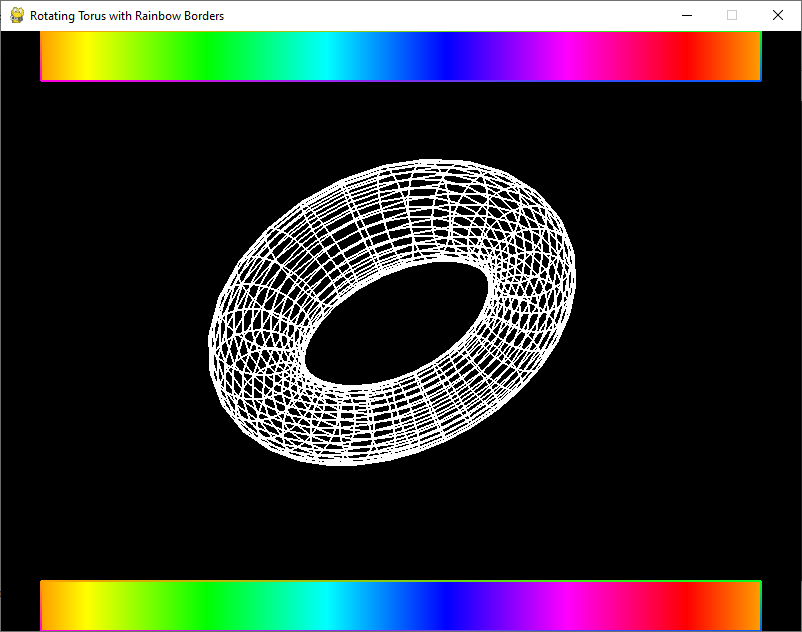
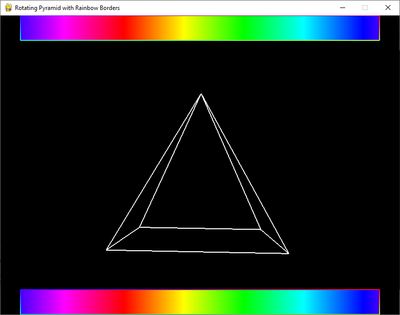

# 3D Examples using Pygame and PyOpenGL

This project demonstrates a couple examples of 3D with rainbow-colored borders using Pygame Community Edition and OpenGL.

Current examples:
	cube.py - a rotating cube
	torus.py - a rotating torus
	pyramid.py - a rotating pyramid


This is a personal project to test the functionality of Pygame and PyOpenGL.





## Features

- 3D rotating shape rendered with OpenGL
- Rainbow-colored rectangles at the top and bottom of the window
- Smooth color transitions in the rainbow borders

## Requirements

- Python 3.x
- Pygame Community Edition
- PyOpenGL

## Installation

1. Clone this repository or download the source code.
2. Install the required dependencies:

   ```
   pip install -r requirements.txt
   ```

## Usage

Run the scripts using Python:

```
python cube.py
or
python torus.py
or
python pyramid.py
```

## Controls

- Close the window to exit the program

## How it works

The program uses Pygame Community Edition to create a window and handle events, and OpenGL for 3D rendering. The main components are:

1. A 3D shape that rotates continuously
2. Two rainbow-colored rectangles at the top and bottom of the window
3. Color transitions that create a moving rainbow effect

The shape is defined by its vertices and edges, and drawn using OpenGL lines. The rainbow effect is achieved by calculating HSV colors and converting them to RGB.

## Customization

You can modify various aspects of any of the programs:

- Adjust the window size by changing the `display` tuple in the `main()` function
- Modify the shapes's rotation speed by changing the values in the `glRotatef()` call
- Adjust the rainbow effect speed by modifying the hue increment value

## LICENSE

[CC0 1.0 Universal](LICENSE)